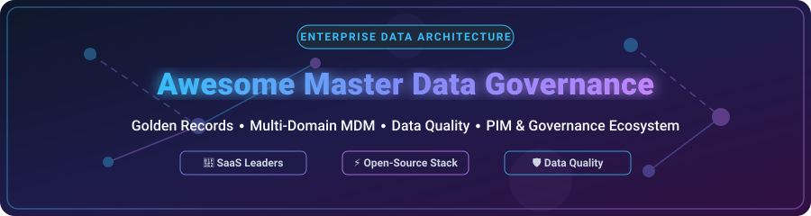

# 👑 Awesome Master Data Governance (MDM)



<p align="center">
  <a href="https://github.com/ishandutta2007/Awesome-Awesome-Awesome"></a><a href="https://discord.gg/jc4xtF58Ve"></a> <a href="https://github.com/sindresorhus/awesome"></a>  
</p>

## 🚀 Overview & Ecosystem Guide

A curated directory of **Enterprise SaaS Platforms**, **Cloud Master Data Management (MDM) Tools**, and **Open-Source Projects** for **Master Data Governance**, **Golden Record Management**, **Data Quality Engine**, **Entity Resolution**, and **Product Information Management (PIM)**.

Master Data Governance ensures an organization maintains a single, trusted "golden record" for core business entities across disparate enterprise systems—including **Customer Data Hubs**, **Product Catalog Hubs**, **Supplier Portals**, and **Financial Master Data**.

---

## 📌 Table of Contents

- [📊 Market Dynamics & Sector Overview](#-market-dynamics--sector-overview)
- [🏢 SaaS & Hosted Enterprise MDM Platforms](#-saas--hosted-enterprise-mdm-platforms)
- [⚡ Open-Source GitHub Projects](#-open-source-github-projects)
- [🏗️ Architectural Blueprint for Custom MDM](#️-architectural-blueprint-for-custom-mdm)
- [🤝 How to Contribute](#-how-to-contribute)
- [📜 Disclaimer](#-disclaimer)

---

## 📊 Market Dynamics & Sector Overview

> 📊 **Sector Insights & Market Dynamics**: The global Master Data Management (MDM) & Data Governance market is estimated at **$20 Billion to $23 Billion** (projected to reach $45B+ by 2030 at a ~16% CAGR). The sector is **moderately fragmented**, featuring established enterprise suite monoliths (IBM, SAP, Informatica) alongside agile cloud-native domain specialists (Reltio, Profisee, Semarchy, Ataccama).

---

## 🏢 SaaS & Hosted Enterprise MDM Platforms

Below is a detailed comparison of market-leading SaaS and Enterprise Master Data Management platforms, sorted by **Company Size (Revenue / Valuation)** in **descending** order.

| 🏢 Platform | 💰 Pricing (Starting Tier) | 🎁 Free Tier / Trial Limits | 📊 Company Size (Revenue / Valuation) | 📝 Overview & Core Strengths |
| :--- | :--- | :--- | :--- | :--- |
| **[IBM InfoSphere MDM](https://www.ibm.com/products/infosphere-master-data-management)** | **$120,000 / year** ($10,000/mo baseline deployment unit) | **30-Day Free Trial** (IBM Cloud $200 credit trial; no permanent free tier) | **$62.5 Billion Revenue** (~$210B Market Cap) | Enterprise-grade multi-domain master data management suite built for high-throughput transactional entity resolution, complex customer data integration (CDI), and financial hierarchies. |
| **[SAP Master Data Governance (MDG)](https://www.sap.com/products/technology-platform/master-data-governance.html)** | **$108,000 / year** ($9,000/mo for 100K object blocks) | **90-Day Free Evaluation** (SAP BTP Free Tier with 10,000 master record capacity limit) | **$36.2 Billion Revenue** (€33.1B / ~$250B Market Cap) | Native master data governance platform for SAP S/4HANA & ERP ecosystems. Automates enterprise master data domain creation, approval workflows, and business partner hierarchies. |
| **[Informatica MDM](https://www.informatica.com/products/master-data-management.html)** | **$24,000 / year** ($2,000/mo IDMC compute baseline) | **30-Day Free Trial** (Intelligent Data Management Cloud IDMC with 500 IPU compute limit) | **$1.64 Billion Revenue** (~$8B Acquisition Valuation) | Market-leading cloud-native AI-driven MDM platform powered by CLAIRE AI. Provides multi-domain master data, data quality, match/merge survivorship, and 360-degree customer views. |
| **[Talend MDM / Qlik](https://www.talend.com/products/master-data-management/)** | **$14,000 / year** ($1,170/mo Cloud Governance package) | **14-Day Free Trial** (Talend Cloud full pipeline access with up to 5 user seats) | **$1.0 Billion+ Revenue** ($2.4B Acquisition by Thoma Bravo) | Unified data integration, quality, and master data governance framework. Enables enterprise data stewardship, record lineage tracking, and automated validation rules. |
| **[EnterWorks (Precisely)](https://www.precisely.com/product/enterworks)** | **$48,000 / year** ($4,000/mo single-domain deployment) | **14-Day Sandbox Trial** (Pre-configured domain environment upon enterprise request) | **$1.0 Billion Revenue** (~$3.5B Enterprise Valuation) | Multi-domain MDM and Product Information Management (PIM) platform tailored for manufacturers, distributors, and retailers managing complex product catalogs and supplier master data. |
| **[Stibo Systems](https://www.stibosystems.com/)** | **$60,000 / year** ($5,000/mo platform package) | **14-Day Guided Sandbox Demo** (Enterprise sandbox environment upon request) | **$160 Million Revenue** (Privately held Stibo A/S Foundation) | Multidomain STEP platform specializing in Product Information Management (PIM) and Master Data Management (MDM) across complex global retail and automotive supply chain hierarchies. |
| **[Reltio](https://www.reltio.com/)** | **$36,000 / year** ($3,000/mo Identity 360 SaaS base) | **Identity 360 Free Tier** (Permanent free tier for up to 2,000 unified profile records) | **$120 Million ARR** ($1.7 Billion Series E Valuation) | Cloud-native multi-domain MDM platform with real-time golden record graph engine, AI-powered match/merge, and zero-downtime scalability for customer and product data. |
| **[Ataccama ONE](https://www.ataccama.com/)** | **$25,000 / year** ($2,083/mo Cloud starter tier) | **30-Day Free Trial** (Ataccama ONE Cloud with up to 10GB dataset profiling limit) | **$90 Million Revenue** ($150M Investment from Bain Capital) | AI-powered data management platform integrating automated data profiling, data quality enforcement, metadata discovery, and master data management in a single cloud interface. |
| **[Profisee](https://profisee.com/)** | **$20,000 / year** ($1,666/mo entry SaaS subscription) | **Microsoft Fabric 30-Day Trial** (Pre-configured data stewardship experience on MS Fabric) | **$60 Million Revenue** (Acquired by Pamlico / TA Associates) | Low-code enterprise MDM platform tightly integrated with the Microsoft Azure data ecosystem (Microsoft Fabric, Purview, Synapse) for fast multi-domain golden record governance. |
| **[Semarchy xDM](https://www.semarchy.com/)** | **$18,000 / year** ($1,500/mo single-domain starter) | **30-Day Full Access Free Trial** (Cloud-hosted evaluation instance with full features) | **$45 Million Revenue** (Acquired by Providence Strategic Growth) | Intelligent Data Hub platform combining MDM, data quality, and data governance. Features an intuitive low-code interface for data stewards and business analysts. |

---

## ⚡ Open-Source GitHub Projects

Below is a curated selection of top open-source projects for **Product Information Management (PIM)**, **Data Governance Catalogs**, **Data Quality Frameworks**, and **Entity Resolution Libraries**, sorted by **GitHub Star Count** in **descending** order.

- **[OpenMetadata](https://github.com/open-metadata/OpenMetadata)**  
  [](https://github.com/open-metadata/OpenMetadata/stargazers)  
  *The open context layer for data and AI. Offers automated metadata management, data lineage, data quality profiling, and business glossary governance.*

- **[DataHub](https://github.com/datahub-project/datahub)**  
  [](https://github.com/datahub-project/datahub/stargazers)  
  *Open-source metadata platform created by LinkedIn for end-to-end data discovery, data observability, lineage, and master data cataloging.*

- **[Great Expectations](https://github.com/great-expectations/great_expectations)**  
  [](https://github.com/great-expectations/great_expectations/stargazers)  
  *Leading Python data quality testing framework for profiling, validating, and documenting datasets—a core building block for MDM data ingestion pipelines.*

- **[Amundsen](https://github.com/amundsen-io/amundsen)**  
  [](https://github.com/amundsen-io/amundsen/stargazers)  
  *Data discovery and metadata platform originally developed at Lyft to search and index master datasets, tables, and organizational data assets.*

- **[Dedupe](https://github.com/dedupeio/dedupe)**  
  [](https://github.com/dedupeio/dedupe/stargazers)  
  *Machine learning Python library for accurate fuzzy matching, record deduplication, and entity resolution in custom MDM pipelines.*

- **[Pimcore](https://github.com/pimcore/pimcore)**  
  [](https://github.com/pimcore/pimcore/stargazers)  
  *Open-source Enterprise Data & Experience Management Platform combining PIM, MDM, Customer Data Platform (CDP), and Digital Asset Management (DAM).*

- **[Soda Core](https://github.com/sodadata/soda-core)**  
  [](https://github.com/sodadata/soda-core/stargazers)  
  *Open-source CLI tool and Python library for data reliability, automated data quality checks, and contract monitoring across enterprise data lakes.*

- **[Marquez](https://github.com/marquezproject/marquez)**  
  [](https://github.com/marquezproject/marquez/stargazers)  
  *OpenLineage reference implementation for collecting, aggregating, and visualizing dataset metadata and pipeline lineage.*

- **[Apache Atlas](https://github.com/apache/atlas)**  
  [](https://github.com/apache/atlas/stargazers)  
  *Scalable open-source metadata management and data governance framework built for the Apache Hadoop ecosystem and cloud data warehouses.*

- **[Apache Griffin](https://github.com/apache/griffin)**  
  [](https://github.com/apache/griffin/stargazers)  
  *Open-source Data Quality module for Big Data ecosystems (streaming & batch), providing data profiling, verification, and anomaly detection.*

- **[Python Record Linkage Toolkit](https://github.com/J535D165/recordlinkage)**  
  [](https://github.com/J535D165/recordlinkage/stargazers)  
  *Python library for linking historical or operational record sets and performing record deduplication with deterministic and probabilistic algorithms.*

- **[AtroPIM / AtroCore](https://github.com/atrocore/atropim)**  
  [](https://github.com/atrocore/atropim/stargazers)  
  *Flexible, modular open-source Product Information Management (PIM) system built on the AtroCore data management foundation for multi-domain master product data.*

---

## 🏗️ Architectural Blueprint for Custom MDM

```
┌─────────────────┐    ┌──────────────────┐    ┌─────────────────────┐    ┌──────────────────┐
│  Data Sources   │ ──>│  Quality & Rules │ ──>│  Entity Resolution  │ ──>│  Golden Record   │
│ (CRM, ERP, PIM) │    │(GreatExpectations)│    │   (Dedupe/Matching) │    │   Data Store     │
└─────────────────┘    └──────────────────┘    └─────────────────────┘    └──────────────────┘
                                                                                   │
                                                                                   ▼
                                                                          ┌──────────────────┐
                                                                          │ Metadata Catalog │
                                                                          │ (OpenMetadata/   │
                                                                          │     DataHub)     │
                                                                          └──────────────────┘
```

When engineering a custom open-source Master Data Management solution:
1. **Domain Modeling & Rules**: Define data schemas, attribute survivorship rules, and validation logic.
2. **Cleansing & Quality Checks**: Validate inbound data with frameworks like **Great Expectations** or **Soda Core**.
3. **Entity Matching & Deduplication**: Use probabilistic ML libraries like **Dedupe** or **Record Linkage** to generate candidate match pairs and resolve duplicate records.
4. **Golden Record Storage**: Publish golden record outputs to an operational store (PostgreSQL, Snowflake, or Elasticsearch).
5. **Governance & Discovery**: Index attributes and dataset lineage in an open catalog like **OpenMetadata** or **DataHub**.

---

## 🤝 How to Contribute

Contributions are warmly welcomed! To suggest a new SaaS platform or Open-Source MDM project:

1. 🍴 **Fork** this repository.
2. 📝 Add your entry under the appropriate section following the established format.
3. 🔗 Include accurate vendor/repo links, starting pricing details, free trial limits, and exact GitHub repo paths.
4. 🚀 Submit a **Pull Request** with a brief summary of the addition.

---

## 📜 Disclaimer

*This list is community-curated for informational and educational purposes. Product pricing, trial limits, and enterprise valuation figures are based on publicly available data, analyst reports, and vendor documentation as of 2026. Master Data Management architectures involve critical business data and compliance requirements; evaluate each solution according to your enterprise security, privacy, and operational standards.*

---
<p align="center">Made with ❤️ for Data Governance Leaders, MDM Architects, and Enterprise Data Engineers.</p>
